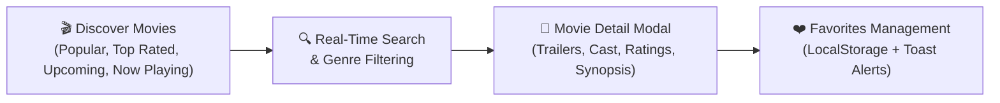
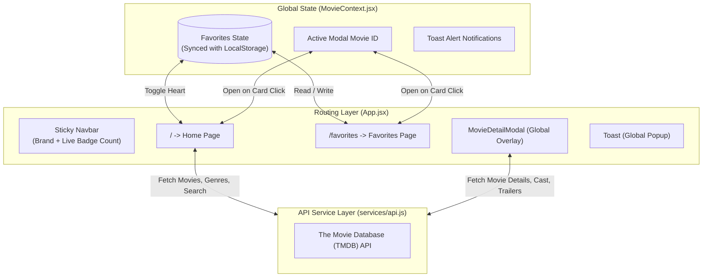
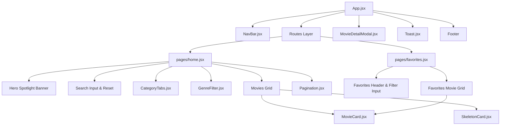
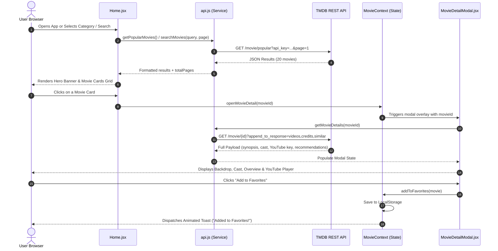

# CineFlix — Modern Cinematic Movie Discovery Web Application

[](https://react.dev/)
[](https://vitejs.dev/)
[](https://reactrouter.com/)
[-01B4E4?style=for-the-badge&logo=the-movie-database&logoColor=white)](https://www.themoviedb.org/)
[](https://vercel.com/)
[](https://github.com/DevanshChaudhary163/MovieApp)

> **A sleek, responsive, and feature-rich movie discovery application built with React 19, Vite, React Router 7, and The Movie Database (TMDB) API. Features real-time movie search, dynamic category browsing (Popular, Top Rated, Now Playing, Upcoming), genre filtering, detailed modal views with embedded YouTube trailers, cast info, similar recommendations, and local storage favorites management with interactive toast alerts.**

---

## Table of Contents

- [1. Live Overview & Features](#1-live-overview--features)
- [2. Quick Start Guide](#2-quick-start-guide)
- [3. Application Architecture](#3-application-architecture)
- [4. Component Hierarchy](#4-component-hierarchy)
- [5. TMDB API Integration & Data Flow](#5-tmdb-api-integration--data-flow)
- [6. Key Features Breakdown](#6-key-features-breakdown)
- [7. Project Structure](#7-project-structure)
- [8. Deployment Guide](#8-deployment-guide)
  - [Deploy to Vercel (1-Click)](#deploy-to-vercel)
  - [Deploy to Netlify](#deploy-to-netlify)
  - [Deploy to GitHub Pages](#deploy-to-github-pages)
- [9. Configuration & Customization](#9-configuration--customization)
- [10. Completed Milestones](#10-completed-milestones)

---

## 1. Live Overview & Features



### Feature Highlights
* **Hero Spotlight Banner:** Prominently displays the top trending movie with high-definition backdrop artwork and direct trailer access.
* **Category & Genre Filtering:** Seamlessly switch between *Popular*, *Top Rated*, *Now Playing*, and *Upcoming* releases, or filter by 19+ genres (Action, Sci-Fi, Comedy, Drama, Horror, etc.).
* **Rich Movie Details Modal:** Click on any movie card to open a full modal containing:
  * High-res poster & backdrop artwork
  * Runtime, release year, language, rating badge with vote counts
  * Official synopsis and tagline
  * **Embedded YouTube Video Player** for trailers and teasers
  * Top Cast cards with actor avatars and character names
  * Interactive "You May Also Like" similar movie recommendations
* **Client-Side Favorites System:** Save favorite movies with a single click, stored persistently in `localStorage`. Includes quick filtering and batch-clearing capabilities.
* **Toast Notification System:** Animated feedback prompts when adding or removing titles from your watchlist.
* **Shimmer Skeleton Loading:** Shimmer loading state cards eliminate layout shifts while data is fetched.
* **Mobile-First Responsive Layout:** Fluid CSS grid and flexbox interfaces tailored for mobile, tablet, and ultra-wide displays.

---

## 2. Quick Start Guide

### Prerequisites
* **Node.js** (v18.0.0 or higher recommended)
* **npm** or **yarn** / **pnpm**

### Installation & Local Run

```bash
# 1. Clone the repository
git clone https://github.com/DevanshChaudhary163/MovieApp.git
cd MovieApp

# 2. Install dependencies
npm install

# 3. Start local development server
npm run dev
```

Open your browser at `http://localhost:5173` to explore the app.

### Production Build & Preview
```bash
# Build the optimized production bundle into /dist
npm run build

# Preview the production build locally
npm run preview
```

---

## 3. Application Architecture

The application is architected around a centralized **React Context Provider** for global application state (watchlist, modals, alerts) and modular components that consume TMDB endpoints:



---

## 4. Component Hierarchy



---

## 5. TMDB API Integration & Data Flow



---

## 6. Key Features Breakdown

### 1. Categories & Genres
* **Dynamic Endpoints:** Supports TMDB `/movie/popular`, `/movie/top_rated`, `/movie/now_playing`, and `/movie/upcoming`.
* **Genre Discover:** Supports TMDB `/discover/movie` with genre IDs dynamically fetched via `/genre/movie/list`.

### 2. Search Experience
* **Debounced & Fast Search:** Full text search querying TMDB with custom clear and reset buttons.
* **Results Counter:** Displays exact matching item counts and feedback.

### 3. Movie Details & Trailer Player
* Uses YouTube `iframe` with `youtube-nocookie.com` for privacy and instant playback.
* Fallback placeholder artwork for movies lacking poster assets.

### 4. Client-Side Persistence
* Saves favorites in browser `localStorage` under `movieapp_favorites`.
* Favorites persist across browser refreshes and device reloads.

---

## 7. Project Structure

```text
MovieApp/
│
├── public/
│   ├── _redirects                  # Static SPA redirect rule for Netlify / Cloudflare
│   └── vite.svg
│
├── src/
│   ├── components/
│   │   ├── CategoryTabs.jsx        # Category buttons (Popular, Top Rated, etc.)
│   │   ├── GenreFilter.jsx         # Horizontal scrollable genre pill filters
│   │   ├── MovieCard.jsx           # Individual card with poster, rating & favorite toggle
│   │   ├── MovieDetailModal.jsx    # Pop-up modal with trailer, cast, and similar titles
│   │   ├── NavBar.jsx              # Sticky header with brand logo & live favorites badge
│   │   ├── Pagination.jsx          # Page navigation controls
│   │   ├── SkeletonCard.jsx        # Shimmer loading cards
│   │   └── Toast.jsx               # Interactive toast notification alerts
│   │
│   ├── contexts/
│   │   └── MovieContext.jsx        # Global React Context for favorites, modal, & alerts
│   │
│   ├── css/
│   │   ├── App.css                 # Layout and footer styles
│   │   ├── Favorites.css           # Favorites page and empty state styles
│   │   ├── Home.css                # Hero banner, filters, and home grid styles
│   │   ├── index.css               # Global theme variables, reset, & typography
│   │   ├── Modal.css               # Detail modal and video player styles
│   │   ├── MovieCard.css           # Card hover effects and skeleton shimmer
│   │   ├── Navbar.css              # Navigation bar glassmorphism styles
│   │   └── Toast.css               # Toast notification slide-in styles
│   │
│   ├── pages/
│   │   ├── favorites.jsx           # Saved favorites collection view
│   │   └── home.jsx                # Main discovery and search feed
│   │
│   ├── services/
│   │   └── api.js                  # TMDB API wrapper functions
│   │
│   ├── App.jsx                     # Route definitions and main layout
│   └── main.jsx                    # React entrypoint
│
├── .github/workflows/
│   └── deploy.yml                  # Automated GitHub Pages CI/CD workflow
│
├── netlify.toml                    # Netlify deployment configuration
├── vercel.json                     # Vercel SPA routing configuration
├── index.html                      # HTML root template with fonts and meta tags
├── package.json                    # Dependencies and scripts
└── vite.config.js                  # Vite configuration
```

---

## 8. Deployment Guide

### Deploy to Vercel (Recommended)

1. Push your repository to GitHub.
2. Go to **[Vercel Dashboard](https://vercel.com/dashboard)** and click **"Add New..." &rarr; "Project"**.
3. Import your `MovieApp` repository.
4. Framework Preset will auto-detect as **Vite**.
5. Click **Deploy**. Vercel will build and deploy your live site with an HTTPS URL in ~30 seconds!

*(The included `vercel.json` ensures that refreshing on `/favorites` routes correctly without 404 errors).*

---

### Deploy to Netlify

1. Push your repository to GitHub.
2. Go to **[Netlify](https://app.netlify.com)** and click **"Add new site" &rarr; "Import an existing project"**.
3. Select GitHub and choose your `MovieApp` repository.
4. Settings:
   * **Build command:** `npm run build`
   * **Publish directory:** `dist`
5. Click **Deploy site**.

*(The included `netlify.toml` and `public/_redirects` handle SPA fallback routing automatically).*

---

### Deploy to GitHub Pages

The repository includes a ready-to-use GitHub Actions workflow at `.github/workflows/deploy.yml`:

1. Go to your repository settings on GitHub: **Settings &rarr; Pages**.
2. Under **Build and deployment &rarr; Source**, select **GitHub Actions**.
3. Push any commit to the `main` branch.
4. The workflow will automatically build and publish your site at `https://<your-username>.github.io/<repo-name>/`.

---

## 9. Configuration & Customization

### Using Your Own TMDB API Key
By default, the application uses a pre-configured demo TMDB key in `src/services/api.js`. To use your own personal key:
1. Create a free account at [The Movie Database (TMDB)](https://www.themoviedb.org/).
2. Request an API key under **Settings &rarr; API**.
3. Replace the `API_KEY` constant in `src/services/api.js`:
   ```javascript
   const API_KEY = "YOUR_TMDB_API_KEY_HERE";
   ```

---

## 10. Completed Milestones

- [x] Full React 19 + Vite 7 migration with clean build outputs.
- [x] TMDB API integration for Popular, Top-Rated, Now Playing, and Upcoming releases.
- [x] Dynamic genre filtering and multi-page pagination.
- [x] Interactive movie details modal with embedded YouTube trailer video player.
- [x] Top cast list with actor avatars and character credits.
- [x] Similar movie recommendation discovery.
- [x] Persistent `localStorage` favorites management.
- [x] Live navbar badge counter for saved favorites.
- [x] Shimmer skeleton loading cards.
- [x] Interactive toast alert notification system.
- [x] Multi-platform deployment configurations for Vercel, Netlify, and GitHub Actions.

---
